# Bedtime Story Generator 🌙

An AI-powered bedtime story generator for children ages 5-10, featuring intelligent story categorization, structured narrative arcs, and quality evaluation with iterative refinement.

## Features

✨ **Smart Story Categorization** - Automatically detects story type from 6 categories:
- Adventure - Action-packed journeys and quests
- Fantasy - Magical worlds with mythical creatures
- Educational - Fun learning experiences
- Friendship - Stories about relationships and kindness
- Courage - Overcoming fears and challenges
- Animal - Charming animal characters and adventures

📐 **Structured Story Arcs** - Creates 5-part narrative structure:
- Setup - Introduces characters and setting
- Rising Action - Presents the challenge
- Climax - Main exciting moment
- Falling Action - Resolution begins
- Resolution - Happy ending with positive lesson

👨‍⚖️ **AI Quality Judge** - Evaluates stories on 4 criteria:
- Age Appropriateness (vocabulary and content for ages 5-10)
- Story Structure (clear beginning, middle, end)
- Engagement (interesting and fun)
- Educational Value (positive moral/lesson)

🔄 **Iterative Refinement** - Automatically improves stories that score below 7/10

💬 **User Feedback** - Request changes after seeing your story

## Installation

### Prerequisites
- Python 3.8 or higher
- OpenAI API key

### Setup Steps

1. **Clone the repository** (or download the files)
```bash
git clone https://github.com/YOUR_USERNAME/bedtime-story-generator.git
cd bedtime-story-generator
```

2. **Install dependencies**
```bash
pip install -r requirements.txt
```

3. **Create `.env` file** in the project root
```bash
# Create .env file with your OpenAI API key
echo "OPENAI_API_KEY=your_actual_api_key_here" > .env
```

Or manually create `.env` file:
```
OPENAI_API_KEY=sk-proj-your-actual-key-here
```

4. **Verify setup** (optional but recommended)
```bash
python config.py
```

You should see:
```
✅ API Key loaded: sk-proj-n-...
✅ Configuration is valid! Ready to run main.py
```

5. **Run the application**
```bash
python main.py
```

## Usage

### Basic Usage
```bash
$ python main.py

🌟 BEDTIME STORY GENERATOR 🌟
   (For children ages 5-10)

What kind of story would you like? a brave dragon who is afraid of flying

🔍 Analyzing request...
   Category: COURAGE
   Themes: bravery, overcoming fears

📐 Planning story structure...
   ✓ Story arc created

📝 Writing courage story...

👨‍⚖️ Judge evaluating...
   
📊 SCORES:
   Age Appropriateness: 9/10
   Story Structure: 8/10
   Engagement: 9/10
   Educational Value: 8/10
   Overall: 8.5/10

✅ Approved! Score: 8.5/10

📖 YOUR BEDTIME STORY:
[Story appears here...]

Make changes? (yes/no):
```

### Example Story Requests

- "a brave warrior"
- "a curious robot who wants to make friends"
- "two cats who go on an adventure"
- "a girl who learns to be kind"
- "a magical forest with talking animals"

## Project Structure
```
bedtime_story_generator/
├── config.py          # Configuration, settings, and constants
├── prompts.py         # All GPT prompt templates
├── agents.py          # Story generation agents and logic
├── main.py            # Entry point and user interface
├── requirements.txt   # Python dependencies
├── .env              # API key (create this, not in repo)
├── .gitignore        # Git ignore rules
└── README.md         # This file
```

### File Responsibilities

- **`config.py`** - Loads environment variables, defines story categories, and category-specific guidelines
- **`prompts.py`** - Contains all prompt templates for categorization, planning, generation, evaluation, and refinement
- **`agents.py`** - Implements all classes: OpenAIClient, data models, and StoryGenerator orchestrator
- **`main.py`** - User interface and application entry point

## Architecture

The system uses a multi-agent architecture:

1. **Story Categorizer** - Analyzes user request to determine story type and extract themes
2. **Story Arc Planner** - Creates detailed 5-part narrative structure
3. **Storyteller** - Generates story using category-specific strategies and story arc
4. **Story Judge** - Evaluates story quality on multiple criteria
5. **Story Refiner** - Improves stories based on judge feedback (if score < 7.0)

### System Architecture

```mermaid
flowchart TD
    A[👤 User Input] --> B[🔍 Story Categorizer]
    B --> |Category + Themes| C[📐 Story Arc Planner]
    C --> |5-Part Structure| D[📝 Storyteller]
    D --> |Generated Story| E{👨‍⚖️ Judge\nScore ≥ 7?}
    E --> |Yes| F[✅ Final Story]
    E --> |No| G[🔄 Story Refiner]
    G --> |Improved Story| E
    F --> H{💬 User Feedback?}
    H --> |Yes| I[Apply Changes]
    I --> E
    H --> |No| J[🌙 Complete!]
    
    style A fill:#e1f5ff
    style E fill:#fff4e1
    style F fill:#d4edda
    style J fill:#d4edda
```


## Configuration

You can customize settings by editing `config.py`:
```python
QUALITY_THRESHOLD = 7.0    # Minimum score for approval
MAX_REFINEMENTS = 2        # Maximum refinement iterations
```

Temperature settings for different agents:
- `TEMP_CATEGORIZATION = 0.3` (precise)
- `TEMP_PLANNING = 0.5` (balanced)
- `TEMP_STORYTELLING = 0.8` (creative)
- `TEMP_EVALUATION = 0.2` (consistent)
- `TEMP_REFINEMENT = 0.7` (creative improvements)

## Cost Estimates

Using GPT-3.5-turbo:
- **Per story**: $0.01-0.02 (1-2 cents)
- **100 stories**: ~$1-2
- **With $5 credit**: 250-500 complete stories

Each story generation uses 4-8 API calls depending on refinement needs.

## Requirements

- Python 3.8+
- openai==2.7.2
- python-dotenv==1.0.0

## Troubleshooting

### "OPENAI_API_KEY not found"
- Ensure `.env` file exists in the project root
- Verify the file contains: `OPENAI_API_KEY=your_key_here`
- Check that `python-dotenv` is installed

### "Module not found" errors
```bash
pip install -r requirements.txt
```

### API rate limit errors
- Wait a few seconds and try again
- Check your OpenAI usage limits at https://platform.openai.com/usage

## Development Notes

### If I had 2 more hours, I would add:

1. **Persistent Storage** - Save generated stories to JSON files so users can build a collection of favorites and revisit them later

2. **Story Length Options** - Allow users to specify short (2-3 min), medium (4-5 min), or long (6-8 min) reading times with corresponding word count adjustments

3. **Comprehensive Unit Tests** - Write pytest tests for each agent with mocked OpenAI responses to ensure reliability and maintainability

4. **Better Error Handling** - Add retry logic for API failures, rate limiting, and more graceful degradation when services are unavailable

5. **Web Interface** - Create a simple Streamlit or Flask UI for better user experience, including the ability to save stories, view history, and share stories

## Design Decisions

### Why This Architecture?

- **Separation of Concerns** - Config, prompts, and logic are clearly separated
- **Easy to Modify** - Prompts can be improved without touching business logic
- **Testable** - Each agent can be tested independently
- **Extensible** - Easy to add new story categories or features
- **Maintainable** - Clear file organization with single responsibilities

### Why These Design Patterns?

- **No over-engineering** - Avoided unnecessary design patterns
- **Pragmatic OOP** - Classes where they add clarity, not complexity
- **Data classes** - Clean, immutable data structures
- **Simple orchestration** - Clear workflow in StoryGenerator class

## License

MIT License - Feel free to use this code for your own projects!

---

**Made with ❤️ for Hippocratic AI coding assignment**